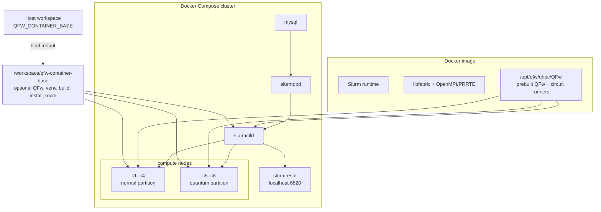
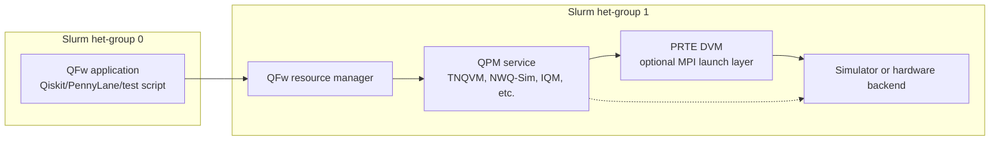

# [QFw]-SLURM Environment

[QFw]-SLURM Environment is a Docker Compose based [Slurm] cluster for [QFw]
development, integration testing, and profiling. It packages the heavy runtime
stack in the image, while keeping the active [QFw] development tree on a host
mount.

The environment supports two common workflows:

- Run the image-contained [QFw] directly from `/opt/qfw/qhpc/QFw`.
- Mount a development [QFw] checkout at `/workspace/qfw-container-base/QFw` and
  build or run that checkout inside the [Slurm] containers.

This is not meant to model production HPC performance. It is meant to give a
repeatable [Slurm], MPI, [libfabric], [DEFw], and [QFw] test environment.

The image also includes the lower-level interface libraries that the [QFw]
QPU front-end shim routes to: [QRMI] (Rust library, Python bindings, and the
SLURM SPANK plugin) and [QDMI] (via IQM's `iqm-qdmi` reference implementation).

## Table Of Contents

- [Build The Environment](#build-the-environment)
- [Start And Use The Cluster](#start-and-use-the-cluster)
- [Build And Run QFw](#build-and-run-qfw)
- [Design Overview](#design-overview)
- [Detailed Reference](#detailed-reference)
- [Troubleshooting](#troubleshooting)

## Build The Environment

<details open>
<summary>Build a local image or configure a pulled image</summary>

All commands assume you are in this repository:

```bash
cd QFw-SLURM-Cluster
```

Required host tools:

- Docker
- Docker Compose

Build the image locally with the default settings:

```bash
./do_configure.sh
./do_build.sh
```

If `--prefix` is omitted, `do_configure.sh` creates and uses:

```text
./shared-dir
```

Build with an explicit host mount and image name:

```bash
./do_configure.sh \
  --prefix /path/to/shared-dir \
  --image-name qfw-slurm-cluster \
  --image-tag rocky10.1 \
  --qfw-build-jobs 4

./do_build.sh
```

Build and tag an image for GHCR:

```bash
./do_configure.sh \
  --prefix /path/to/shared-dir \
  --image ghcr.io/openqse/qfw-slurm-cluster:20260503-v1.0 \
  --qfw-build-jobs 4

./do_build.sh
```

Use an already-built image without rebuilding:

```bash
docker pull ghcr.io/openqse/qfw-slurm-cluster:20260503-v1.0

./do_configure.sh \
  --prefix /path/to/shared-dir \
  --image ghcr.io/openqse/qfw-slurm-cluster:20260503-v1.0

./do_startup.sh
```

Do not run `./do_build.sh` in the prebuilt-image workflow unless you intend to
rebuild the image locally.

For a private GHCR image, log in first with a GitHub token that has
`read:packages` access:

```bash
echo "${GHCR_TOKEN}" | docker login ghcr.io \
  -u <github-username> \
  --password-stdin
```

</details>

## Start And Use The Cluster

<details open>
<summary>Start, enter, inspect, and stop the [Slurm] cluster</summary>

Start the cluster and register it with [Slurm]DBD:

```bash
./do_startup.sh
```

Enter the [Slurm] controller:

```bash
./do_ssh.sh
```

Enter a compute node:

```bash
./do_ssh.sh c1
./do_ssh.sh c2
```

Inspect [Slurm] from inside `slurmctld`:

```bash
sinfo
scontrol show nodes
squeue
```

Run a simple [Slurm] command:

```bash
srun -N1 -n1 hostname
```

Allocate two nodes interactively:

```bash
salloc -N2 -n2
srun hostname
```

Stop the cluster without deleting named volumes:

```bash
./do_stop.sh
```

Stop and remove containers plus named volumes:

```bash
./do_stop.sh delete
```

If you rebuild an image and need existing containers recreated from the new
image:

```bash
./do_restart.sh --force-recreate
```

</details>

## Build And Run [QFw]

<details open>
<summary>Build and run the development [QFw]</summary>

Use this path only when you want to build a host-mounted [QFw] checkout.
`do_configure.sh` writes `QFW_CONTAINER_BASE` into `qfw-install.env` and
`.env`. Docker Compose bind-mounts that host directory into every [Slurm]
container at:

```text
/workspace/qfw-container-base
```

Create development directories only as needed. A typical layout is:

```text
shared-dir/
  QFw/          # optional active QFw checkout
  venv/         # optional Python venv created inside the container
  build/        # optional QFw build tree
  install/      # optional QFw install tree
  benchmarks/   # optional benchmark outputs
  rocm/         # optional ROCm prefix for ROCm/HIP builds
```

1. Configure the host mount and clone [QFw]:

```bash
QFW_CONTAINER_BASE=/path/to/shared-dir

./do_configure.sh --prefix "${QFW_CONTAINER_BASE}"

git clone --recursive git@github.com:openQSE/QFw.git \
  "${QFW_CONTAINER_BASE}/QFw"
```

2. Start the cluster and SSH into `slurmctld`:

```bash
./do_startup.sh
./do_ssh.sh
```

3. Build [QFw] inside `slurmctld`:

```bash
python3 -m venv /workspace/qfw-container-base/venv
source /workspace/qfw-container-base/venv/bin/activate

python -m pip install --upgrade pip setuptools wheel
python -m pip install \
  -r /workspace/qfw-container-base/QFw/setup/build-requirements.txt

cd /workspace/qfw-container-base/QFw/setup
./qfw_configure -c config/qfw_config_sample_container.yaml
./qfw_build.sh --python --defw
```

4. Activate [QFw]:

```bash
source /workspace/qfw-container-base/QFw/setup/qfw_activate
```

5. Run the [QFw] MPI smoke test:

```bash
cd /workspace/qfw-container-base/QFw/examples
./qfw_mpi_smoke.sh
```

6. Deactivate [QFw]:

```bash
qfw_deactivate
```

TNQVM and NWQ-Sim are already built in the image. The development checkout can
use those runners without rebuilding them. Rebuild them only when you need
development versions:

```bash
cd /workspace/qfw-container-base/QFw/setup
source /workspace/qfw-container-base/venv/bin/activate

./qfw_build.sh --tnqvm --nwqsim
```

If the mounted [QFw] checkout has its own build artifacts, `qfw_activate`
prepends the mounted checkout paths, so development artifacts take precedence
over the built-in image artifacts.

</details>

<details>
<summary>Use the built-in image [QFw]</summary>

Use this path when you want to run the image-contained [QFw] without a mounted
development checkout. The built-in [QFw] lives at:

```text
/opt/qfw/qhpc/QFw
```

```bash
cd /opt/qfw/qhpc/QFw
source /opt/qfw/qhpc/QFw/setup/qfw_activate
```

The image exposes [OpenMPI], [libfabric], built-in [QFw], and prebuilt
circuit-runner paths in `PATH` and `LD_LIBRARY_PATH`.

</details>

## Design Overview

<details>
<summary>High-level architecture</summary>

The environment has three important layers:

- Host workspace: scripts and optional mounted QFw development artifacts.
- Docker image: [Slurm], [OpenMPI], [libfabric], modules, and image-contained [QFw].
- Compose cluster: [Slurm] services and compute nodes using the image and mount.



[QFw] runtime tests commonly use a heterogeneous [Slurm] allocation. The
application runs on group 0, while resource-manager and QPM services run on
group 1. QPM services may launch simulators through MPI/PRTE or talk directly
to a device or service backend.

QPM service examples include [TNQVM] and [NWQ-Sim].



</details>

## Detailed Reference

<details>
<summary>What the image contains</summary>

The image builds and installs:

- [Slurm]
- Rocky 10 system Python 3.12
- `environment-modules`
- GCC toolchain from Rocky 10
- [libfabric]
- [OpenMPI] with the bundled [PRRTE] checkout
- OSU Micro-Benchmarks
- [QFw] under `/opt/qfw/qhpc/QFw`
- [QFw] Python venv under `/opt/qfw/qhpc/venv`
- [QFw] build and install artifacts under `/opt/qfw/qhpc/build/image` and
  `/opt/qfw/qhpc/install/image`
- prebuilt [TNQVM] and [NWQ-Sim] circuit runners:
  `circuit_runner.tnqvm` and `circuit_runner.nwqsim`
- [QFw] build dependencies such as `cmake`, `gcc-gfortran`, `openblas-devel`,
  `swig`, `scons`, `ninja-build`, and a pinned Rust toolchain under
  `/opt/qfw/rust`
- [QRMI] runtime: `libqrmi.so` and `qrmi.h` under `/opt/qfw/qrmi/`, the `qrmi`
  Python wheel installed into the [QFw] venv, and the SLURM SPANK plugin
  installed into `/usr/lib64/slurm/`
- [QDMI] runtime: IQM's `iqm-qdmi[qiskit]` wheel installed into the [QFw]
  venv

The image-level runtime environment includes:

```text
/opt/qfw/openmpi/bin
/opt/qfw/libfabric/bin
/opt/qfw/qhpc/QFw/bin
/opt/qfw/openmpi/lib
/opt/qfw/libfabric/lib
/opt/qfw/qhpc/install/image/TNQVM/exatn/lib
/opt/qfw/qhpc/install/image/TNQVM/xacc/lib
/opt/qfw/qhpc/build/image/TNQVM/tnqvm/plugins
/opt/qfw/qhpc/install/image/NWQSIM/lib
/opt/qfw/qrmi/lib
```

`QRMI_PREFIX` is set to `/opt/qfw/qrmi` so consumers can locate the QRMI
headers and shared library without hard-coding the path.

`qfw_activate` is still explicit. The image entrypoint does not globally source
it because activation rewires the Python environment.

</details>

<details>
<summary>Helper scripts and generated files</summary>

`./do_configure.sh` prepares the host workspace and writes:

- `qfw-install.env`, used by helper scripts
- `.env`, used by Docker Compose

Useful options:

```bash
./do_configure.sh --help
./do_configure.sh --dry-run
./do_configure.sh --prefix /path/to/shared-dir
./do_configure.sh --image ghcr.io/openqse/qfw-slurm-cluster:20260503-v1.0
./do_configure.sh --qfw-build-jobs 4
```

`./do_build.sh` builds the configured image:

```bash
./do_build.sh
./do_build.sh --dry-run
./do_build.sh --force
```

`--force` stops and removes the current Compose stack with
`./do_stop.sh delete` and rebuilds with `docker build --no-cache`.

`./do_startup.sh` starts the Compose services, waits for `slurmdbd`, and runs
`./register_cluster.sh`.

`./do_images.sh` lists local image variants:

```bash
./do_images.sh
./do_images.sh --configured
./do_images.sh --configured --history
./do_images.sh --repo ghcr.io/openqse/qfw-slurm-cluster --tag 20260503-v1.0
```

</details>

<details>
<summary>Cluster topology</summary>

`docker-compose.yml` starts:

- `mysql`: [Slurm] accounting database
- `slurmdbd`: [Slurm] database daemon
- `slurmctld`: [Slurm] controller
- `slurmrestd`: [Slurm] REST daemon, exposed on `localhost:6820`
- `c1` through `c8`: compute nodes running `slurmd`

The current [Slurm] config defines:

- `normal`: `c1` through `c4`
- `quantum`: `c5` through `c8`

The quantum nodes carry example `Gres` and `Features` values for QPU-oriented
testing.

Each [Slurm] service runs with Docker `init: true` so exited child processes are
reaped correctly inside containers.

</details>

<details>
<summary>Persistent mounts and volumes</summary>

The host [QFw] workspace is mounted into all [Slurm] service containers:

```text
${QFW_CONTAINER_BASE}:/workspace/qfw-container-base
```

Other important shared paths are:

- `/data`: backed by the `slurm_jobdir` named volume, useful for [Slurm] job
  outputs.
- `/mnt`: backed by `./shared-dir`, useful for host-managed scripts visible in
  the containers.
- `/etc/slurm`: backed by the `etc_slurm` named volume after the cluster is
  created.

The `/etc/slurm` volume is important. The Docker image copies repository [Slurm]
configuration into `/etc/slurm` during build, but once the named volume exists,
the volume overrides the image-baked files. Use `./update_slurmfiles.sh` to
refresh live [Slurm] config without rebuilding:

```bash
./update_slurmfiles.sh slurm.conf
./update_slurmfiles.sh slurm.conf gres.conf rest.conf
```

If you change the configured host mount path after containers already exist,
recreate the containers:

```bash
./do_restart.sh --force-recreate
```

For a full reset, including named volumes:

```bash
./do_stop.sh delete
./do_startup.sh
```

</details>

<details>
<summary>Modules, ROCm, and MPI checks</summary>

The image includes `environment-modules` and modulefiles in:

```text
/etc/modulefiles
```

Typical interactive use:

```bash
module use /etc/modulefiles
module avail
module load gcc-native/13.2 cmake openblas swig
```

ROCm can be provided as an optional mounted prefix. If you need it, create and
use:

```text
/workspace/qfw-container-base/rocm
```

Override it if needed:

```bash
export QFW_ROCM_ROOT=/workspace/qfw-container-base/rocm
module use /etc/modulefiles
module load rocm
```

Run an MPI sanity check through [Slurm]:

```bash
srun -N2 -n2 \
  /opt/qfw/osu-micro-benchmarks/libexec/osu-micro-benchmarks/mpi/pt2pt/osu_latency
```

Run a direct `mpirun` sanity check:

```bash
export OMPI_ALLOW_RUN_AS_ROOT=1
export OMPI_ALLOW_RUN_AS_ROOT_CONFIRM=1

mpirun -np 2 \
  /opt/qfw/osu-micro-benchmarks/libexec/osu-micro-benchmarks/mpi/pt2pt/osu_latency
```

Use `srun` when [Slurm] should control placement. Use `mpirun` for direct MPI
sanity checks inside a container shell.

</details>

<details>
<summary>Submitting jobs and using REST</summary>

Submit a simple batch job from inside `slurmctld`:

```bash
cd /data
sbatch --wrap="hostname"
cat /data/slurm-<jobid>.out
```

Submit a script from the host-managed shared directory:

```bash
sbatch /mnt/simple.sbatch
```

Run commands immediately:

```bash
srun -N1 -n1 hostname
srun -N2 -n2 hostname
```

The [Slurm] REST daemon is exposed on:

```text
http://localhost:6820
```

The `rest-testing/` directory contains example REST scripts and client code.

</details>

<details>
<summary>Image names, GHCR, and local image inspection</summary>

Docker image repository names must be lowercase and may contain path components
separated by `/`, using letters, digits, `.`, `_`, and `-`.

Good examples:

```text
qfw-slurm-cluster:rocky10.1
ghcr.io/openqse/qfw-slurm-cluster:20260503-v1.0
```

Inspect the configured local image:

```bash
./do_images.sh --configured
```

Inspect image layer sizes before pushing to GHCR:

```bash
./do_images.sh --configured --history
```

GHCR allows up to 10 GB per layer and has an upload timeout. A total image can
be larger than 10 GB if each individual layer is below the layer limit.

</details>

<details>
<summary>Adding nodes or changing [Slurm] config</summary>

To add more compute nodes:

1. Add a new service to `docker-compose.yml` using `c1` through `c8` as a
   template.
2. Add the node to `slurm.conf`.
3. Refresh the live cluster config.

Example refresh:

```bash
./update_slurmfiles.sh slurm.conf
docker compose --env-file qfw-install.env restart
./register_cluster.sh
```

Rebuild the image only when you change image contents, such as:

- `Dockerfile`
- installed packages
- source-built dependencies such as [libfabric] or [OpenMPI]
- modulefiles under `modulefiles/`

For plain [Slurm] config changes, use `./update_slurmfiles.sh ...`.

</details>

<details>
<summary>Notes and caveats</summary>

- This is a Docker-based virtual [Slurm] cluster, not a hardware-faithful HPC
  system.
- It is useful for [QFw] integration testing, launcher debugging, service
  bring-up, and software-overhead profiling.
- It will not reproduce production interconnect behavior.
- The image patches [Slurm]'s completion profile script so non-interactive shells
  do not fail before [QFw] SSH and [PRRTE] startup paths run.
- The Compose stack shares `/root/.ssh` across [Slurm] containers and starts
  `sshd`, so root-to-root SSH between containers works for [QFw] launch paths.
- [QFw] does not require a shared host filesystem for all internal infrastructure
  paths, but some simulators may have their own file-sharing assumptions. For
  example, multi-rank [NWQ-Sim] statevector dumps expect the dump path to be
  visible to all MPI ranks.

</details>

## Troubleshooting

<details>
<summary>Common fixes</summary>

If `qfw-install.env` is missing:

```bash
./do_configure.sh
```

If Compose still uses an old mount path:

```bash
./do_restart.sh --force-recreate
```

If [Slurm] config changes are not visible inside the running containers:

```bash
./update_slurmfiles.sh slurm.conf gres.conf rest.conf cgroup.conf
```

If a mounted Python venv came from an older image:

```bash
./do_ssh.sh
rm -rf /workspace/qfw-container-base/venv
python3 -m venv /workspace/qfw-container-base/venv
```

If Docker cache is suspect:

```bash
./do_build.sh --force
./do_startup.sh
```

If you only need to see what a helper would run:

```bash
./do_configure.sh --dry-run
./do_build.sh --dry-run
./do_startup.sh --dry-run
./do_restart.sh --dry-run
```

</details>

[DEFw]: https://github.com/openQSE/DEFw
[libfabric]: https://github.com/ofiwg/libfabric
[NWQ-Sim]: https://github.com/pnnl/NWQ-Sim
[OpenMPI]: https://github.com/open-mpi/ompi
[PRRTE]: https://github.com/openpmix/prrte
[QDMI]: https://pypi.org/project/iqm-qdmi/
[QFw]: https://github.com/openQSE/QFw
[QRMI]: https://github.com/qiskit-community/qrmi
[Slurm]: https://github.com/SchedMD/slurm
[TNQVM]: https://github.com/ornl-qci/tnqvm
